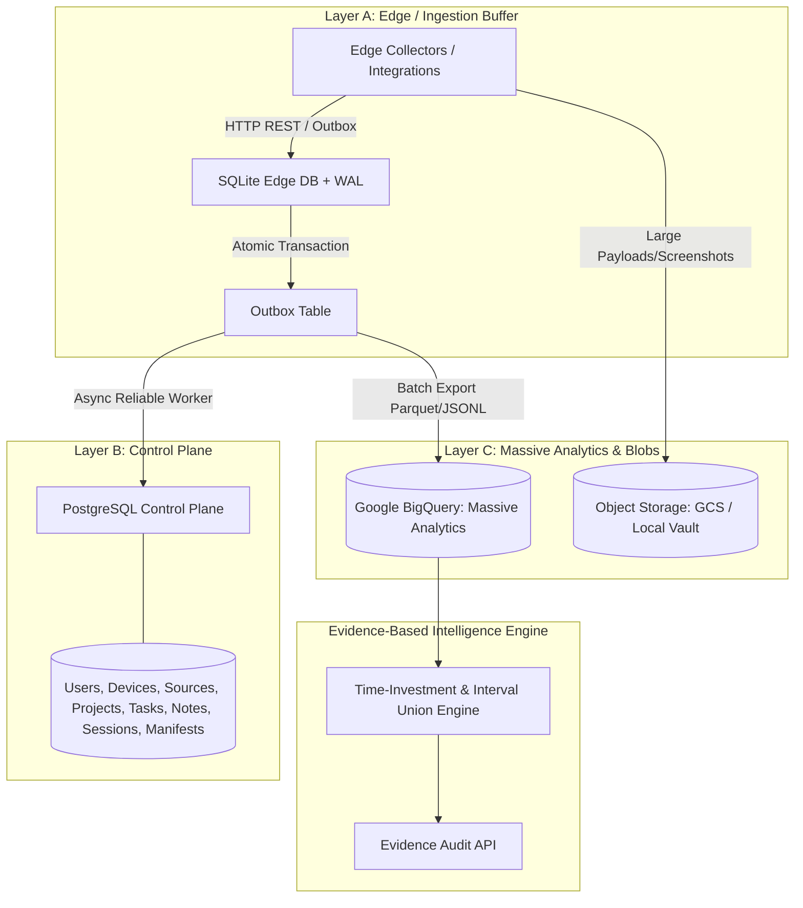

# Personal Digital History Platform - Architecture

## 1. Executive Summary

The **Personal Digital History Platform** is a massive-scale, high-throughput personal telemetry and time-investment observability system. It is designed to scale gracefully from single-event local edge ingestion up to billions and trillions of events over a lifetime.

---

## 2. Three-Layer Data Architecture



### Layer A — Edge / Local (SQLite + Outbox)
- **Role**: High-speed, offline-first local buffer, deduplication engine, and sync retry queue.
- **Characteristics**: PRAGMA journal_mode = WAL, synchronous = NORMAL, composite index on payload hash for $O(1)$ idempotency.
- **Rule**: Never expected to store trillions of historical rows; spools and syncs upstream.

### Layer B — Control Plane (PostgreSQL)
- **Role**: Transactional system of record for entities, devices, sources, tasks, notes, session definitions, sync manifests, and access policies.
- **Characteristics**: Strongly normalized relational schema accessed through clean repository traits (`EventRepository`, `SessionRepository`, `AuditRepository`).

### Layer C — Massive Analytical Data (Google BigQuery + Object Storage)
- **Role**: Immutable append-only event warehouse.
- **Partitioning**: Date-partitioned by `event_date`.
- **Clustering**: Clustered by `user_id`, `source_id`, `event_type`, `project_id`.
- **Object Storage**: High-volume binaries (screenshots, screen recordings, full OCR dumps) stored in Cloud Storage with URI references and SHA-256 content hashes.

---

## 3. Golden Data Pipeline

```text
Raw Source Event (Immutable, Never Overwritten)
      ↓
Validation & Payload Hashing (SHA-256)
      ↓
Canonical Telemetry Event (UUIDv7 Universal Envelope)
      ↓
Outbox Enqueue (Zero-Loss Guarantee)
      ↓
Sessionization & Interval Union Engine
      ↓
Derived Activity & Audit Records (Traceable Provenance)
```
