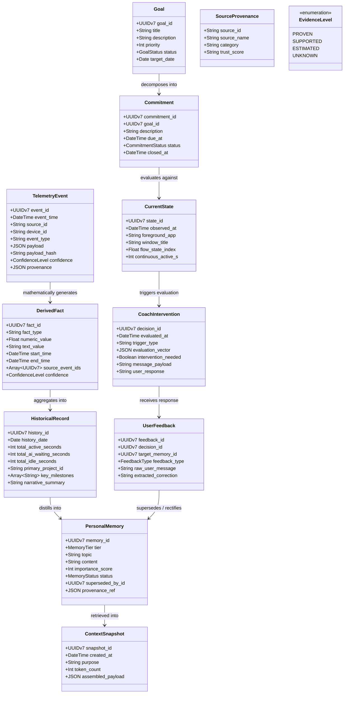

# PERSONAL LIFE HISTORY, CONTEXT RETRIEVAL & AI COACH ARCHITECTURE
## Complete Formal Specification & Implementation Blueprint
**Document Version:** `2.0.0-FROZEN-SPEC`  
**Document ID:** `SPEC-2026-COACH-CORE`  
**Classification:** `ARCHITECTURE SPECIFICATION ONLY — NO DIRECT CODE IMPLEMENTATION`  
**Target Path:** `/home/mdkamruzzamanirak_gmail_com/.openclaw/workspace/IROSCRIPT-CEO/PERSONAL AI AGENT/telemetry_platform/docs/PERSONAL_AI_COACH_SPECIFICATION.md`  
**Base Dependency:** Frozen SQLite Edge Telemetry Foundation (`src/migrations/0001_initial_telemetry_schema.sql`)  
**Target Audience:** Principal Systems Architect, Backend & Data Engineers, Antigravity Intelligence Core  
**Owner:** ইরাক ভাইয়া (Iraq Bhai)  

---

## 1. Architecture Overview & Foundational Principles

### 1.1 Scope & Mission
The objective of this architecture is to build a sovereign, privacy-preserving, and epistemically rigorous **Personal Life History, Memory, Context Builder, and Autonomous AI Executive Coach** that sits strictly **ABOVE** the frozen SQLite Edge Telemetry Foundation.

```text
+-----------------------------------------------------------------------------------+
|                            LAYER 7: NOTIFICATION & CHANNELS                       |
|          WhatsApp Baileys Bridge  |  Web Terminal (tmux)  |  Desktop Popup        |
+-----------------------------------------------------------------------------------+
                                         ▲
                                         │ Minimum Viable Interventions (MVI)
+-----------------------------------------------------------------------------------+
|                            LAYER 6: AI COACH DECISION ENGINE                      |
|       Dual-Trigger Scheduler (30/60m + Events)  |  10-Step Evaluation Matrix      |
|       Intervention Gatekeeper (Silence by Default: NO_INTERVENTION)               |
+-----------------------------------------------------------------------------------+
                                         ▲
                                         │ Dynamic Elastic Context (Configurable Budget)
+-----------------------------------------------------------------------------------+
|                            LAYER 5: ELASTIC CONTEXT BUILDER                       |
|       Hybrid Multi-Source Retrieval  |  Relevance & Recency Scoring Engine        |
|       Contradiction Resolver  |  Confidence & Commitment Weighting                |
+-----------------------------------------------------------------------------------+
                                         ▲
                                         │ Working / Episodic / Semantic Memories
+-----------------------------------------------------------------------------------+
|                            LAYER 4: PERSONAL MEMORY & GOALS                       |
|       Tiered Curated Memory (Working, Episodic, Semantic)                         |
|       Goals, Commitments, Open Loops, Preferences, Next Actions                   |
|       User Feedback & Bidirectional Correction Engine                             |
+-----------------------------------------------------------------------------------+
                                         ▲
                                         │ Longitudinal Aggregations & Rollups
+-----------------------------------------------------------------------------------+
|                            LAYER 3: PERSONAL LIFE HISTORY                         |
|       Longitudinal Life History Store (Hours, Days, Weeks, Months, Years)         |
|       Session Narratives, Project Attribution, Non-Destructive Corrections        |
+-----------------------------------------------------------------------------------+
                                         ▲
                                         │ Proven Mathematical Facts (Interval Union)
+-----------------------------------------------------------------------------------+
|                            LAYER 2: OBJECTIVE FACT DERIVATION                     |
|       Deterministic Computations: Active Durations, App Focus, Line Diffs         |
+-----------------------------------------------------------------------------------+
                                         ▲
                                         │ READ-ONLY Access to Canonical Raw Events
+===================================================================================+
|               LAYER 1: FROZEN SQLITE EDGE TELEMETRY FOUNDATION (FROZEN)           |
|   local_events (WAL) | outbox_events | time_intervals | devices | sources | links |
+===================================================================================+
```

### 1.2 Non-Negotiable Architectural Axioms
1. **The Telemetry Core is Frozen:** The underlying SQLite edge schema, outbox worker, and interval union calculations are immutable ground truth. Upper layers have strictly **READ-ONLY** access to `local_events` and `time_intervals`.
2. **Reality $\neq$ Deduction $\neq$ Memory:** Raw sensor data (Evidence) is distinct from mathematical deductions (Facts), which are distinct from historical rollups (History), which are distinct from curated wisdom (Memory), which are distinct from AI prompts (Context). Conflating these leads to uncorrectable hallucinations.
3. **Silence is the Default Operating State:** A high-end personal coach remains quiet most of the time. The coach evaluates the user's state on periodic ticks (30m/60m) and event triggers, but defaults to **`NO_INTERVENTION`** unless a strict, high-signal necessity threshold is crossed.
4. **User Correction is Absolute Ground Truth:** AI interpretations are tentative hypotheses. When Irak bhai issues a correction (*"That's wrong, I was researching, not working"*), the AI's prior interpretation is immediately superseded, the correction is permanently journaled, and derived memories are recalculated.
5. **Elastic Context Budgeting:** Arbitrary static limits (e.g., 500–1,000 tokens) are explicitly rejected. Context assembly is dynamic, elastic, and configurable, adjusting to the query or intervention depth.
6. **No Vector Bloat Without Demonstrated Need:** High-performance relational queries, keyset pagination, and structured keyword/tag indices handle 95% of personal retrieval. Semantic vector search is reserved strictly for unstructured natural language memory lookups and is decoupled behind an abstract trait.

---

## 2. Required Conceptual Entities

The architecture formally defines **12 core entities**. Each entity has distinct responsibilities, lifecycle rules, confidence bindings, and mutability constraints.



### Entity 1: Event (`TelemetryEvent`)
- **Purpose:** Represents an immutable, discrete sensor observation from the edge (Chrome, Android, WhatsApp, Shell, OpenRecall).
- **Primary Key:** `event_id` (UUIDv7, monotonically increasing with millisecond timestamp).
- **Required Fields:** `event_id`, `event_time`, `ingested_at`, `source_id`, `device_id`, `user_id`, `event_type`, `idempotency_key`, `payload`, `payload_hash`, `confidence`, `provenance`.
- **Optional Fields:** `session_id`, `project_id`, `task_id`, `note_id`, `trace_id`, `parent_event_id`, `source_record_id`.
- **Relationships:** Belongs to `sources` (`source_id`), belongs to `devices` (`device_id`), optionally linked to `sessions` (`session_id`).
- **Provenance:** Captures capture engine, bridge name, scraper version, and host environment.
- **Confidence:** `PROVEN` (direct sensor log) or `SUPPORTED` (inferred from bridge webhook).
- **Lifecycle:** Created at edge $\rightarrow$ Ingested into `local_events` $\rightarrow$ Enqueued in `outbox_events` $\rightarrow$ Dispatched to central store.
- **Retention Policy:** Kept in local edge SQLite for minimum 30–90 days; preserved indefinitely in compressed cold analytical storage (BigQuery/JSONL).
- **Mutability:** **STRICTLY IMMUTABLE (Append-Only).** Never updated or deleted.

### Entity 2: Fact (`DerivedFact`)
- **Purpose:** Represents an objective truth calculated deterministically from raw evidence without LLM speculation.
- **Primary Key:** `fact_id` (UUIDv7).
- **Required Fields:** `fact_id`, `fact_type`, `start_time`, `end_time`, `confidence_level`, `source_event_ids`, `created_at`.
- **Optional Fields:** `session_id`, `entity_reference`, `numeric_value` (e.g. seconds, count, line diffs), `text_value` (e.g. application name).
- **Relationships:** References 1 or more `local_events` via `source_event_ids` (JSON array of UUIDs).
- **Provenance:** Calculated by deterministic Rust engines (e.g., Interval Union engine, Git diff analyzer).
- **Confidence:** `PROVEN` (exact timestamps / line numbers) or `SUPPORTED` (heuristically bounded intervals).
- **Lifecycle:** Generated during post-ingestion fact extraction $\rightarrow$ Stored in `derived_facts` $\rightarrow$ Feeds longitudinal history.
- **Retention Policy:** Kept online in operational database for minimum 365 days.
- **Mutability:** **IMMUTABLE.** If underlying calculation rules change, new facts are versioned and recalculated; existing records are not altered in-place.

### Entity 3: Historical Record (`HistoricalRecord`)
- **Purpose:** Represents a chronological, longitudinal rollup of Irak bhai's daily work sessions, projects, activities, and milestones.
- **Primary Key:** `history_id` (UUIDv7).
- **Required Fields:** `history_id`, `history_date` (ISO `YYYY-MM-DD`, UNIQUE), `total_active_seconds`, `total_ai_waiting_seconds`, `total_idle_seconds`, `session_count`, `context_switch_count`, `created_at`, `updated_at`.
- **Optional Fields:** `primary_project_id`, `key_milestones` (JSON array), `narrative_summary` (AI-synthesized daily narrative, clearly tagged as interpretation), `tags`.
- **Relationships:** Links to multiple `derived_facts` and `sessions`.
- **Provenance:** Daily rollup cron job synthesizing verified facts.
- **Confidence:** `PROVEN` for time totals; `SUPPORTED` for project attribution summaries.
- **Lifecycle:** Initial draft compiled at end of day $\rightarrow$ Finalized after 24 hours $\rightarrow$ Can be amended non-destructively if user provides retrospective feedback.
- **Retention Policy:** **PERMANENT.** Kept forever as the user's autobiographical digital history.
- **Mutability:** **MUTABLE (Audit-Logged).** Modifications to narrative summaries create an audit version; raw numeric totals remain derived from facts.

### Entity 4: Personal Memory (`PersonalMemory`)
- **Purpose:** High-order curated knowledge and long-term wisdom distilled from historical records and user instructions.
- **Primary Key:** `memory_id` (UUIDv7).
- **Required Fields:** `memory_id`, `memory_tier` (`WORKING`, `EPISODIC`, `SEMANTIC`), `topic`, `content`, `importance_score` (1–10), `reinforcement_count`, `status` (`ACTIVE`, `SUPERSEDED`, `REFUTED`), `created_at`, `updated_at`.
- **Optional Fields:** `superseded_by_id`, `source_reference` (JSON referencing evidence, feedback, or notes), `last_accessed_at`, `expiration_date`.
- **Relationships:** Self-referencing link (`superseded_by_id` $\rightarrow$ `memory_id`); references `user_feedback`.
- **Provenance:** Extracted by Memory Curator Service or explicitly dictated by the user (*"Remember this"*).
- **Confidence:** `PROVEN` (if explicitly stated by user), `SUPPORTED` (inferred from repeated verified behavior), or `ESTIMATED` (tentative inference).
- **Lifecycle:** Created $\rightarrow$ Reinforced (upon repeated observation) $\rightarrow$ Superseded (if corrected) or Deprecated (if expired).
- **Retention Policy:** 
  - Working Memory: 1 to 7 days.
  - Episodic Memory: 30 days to 1 year (or permanent if importance $\ge 8$).
  - Semantic Memory: Permanent (unless explicitly refuted by user).
- **Mutability:** **MUTABLE VIA STATE TRANSITIONS.** Never erased; status changes to `SUPERSEDED` or `REFUTED` with reference to the replacing memory.

### Entity 5: Goal (`Goal`)
- **Purpose:** Captures Irak bhai's high-level aspirations, quarterly benchmarks, and personal milestones.
- **Primary Key:** `goal_id` (UUIDv7).
- **Required Fields:** `goal_id`, `title`, `priority` (1–5), `status` (`ACTIVE`, `ACHIEVED`, `PAUSED`, `ABANDONED`), `created_at`, `updated_at`.
- **Optional Fields:** `parent_goal_id`, `description`, `target_date`, `success_metrics` (JSON), `closed_at`.
- **Relationships:** Self-referencing hierarchy (`parent_goal_id` $\rightarrow$ `goal_id`); parent to 1 or more `commitments`.
- **Provenance:** Created exclusively through explicit user prompt, strategic planning session, or user-confirmed note extraction.
- **Confidence:** `PROVEN` (explicit user directive).
- **Lifecycle:** Drafted $\rightarrow$ Active $\rightarrow$ In Progress $\rightarrow$ Achieved / Paused / Abandoned.
- **Retention Policy:** Permanent history of goals achieved and abandoned.
- **Mutability:** **MUTABLE.** Status, priority, and target dates can be adjusted by the user.

### Entity 6: Commitment (`Commitment`)
- **Purpose:** Concrete obligations, explicit promises, and task deadlines agreed upon by Irak bhai (*"Must complete X by Thursday"*).
- **Primary Key:** `commitment_id` (UUIDv7).
- **Required Fields:** `commitment_id`, `source_type` (`USER_EXPLICIT`, `NOTE_EXTRACTED`, `COACH_AGREEMENT`), `description`, `status` (`OPEN`, `IN_PROGRESS`, `FULFILLED`, `DROPPED`), `created_at`, `updated_at`.
- **Optional Fields:** `goal_id`, `due_at`, `closed_at`, `closure_reason`, `external_task_ref`.
- **Relationships:** Belongs to `goals` (`goal_id`), links to `session_links` (`external_task_ref`).
- **Provenance:** Explicit user command or confirmed note capture.
- **Confidence:** `PROVEN` (if user explicitly typed it) or `SUPPORTED` (if parsed from a TODO note with user validation).
- **Lifecycle:** Open $\rightarrow$ In Progress $\rightarrow$ Fulfilled / Dropped.
- **Retention Policy:** Permanent audit trail of commitments kept or missed.
- **Mutability:** **MUTABLE.** Status changes upon fulfillment or cancellation.

### Entity 7: Current State (`CurrentState`)
- **Purpose:** High-frequency, real-time snapshot of Irak bhai's immediate operational context (last 30 minutes).
- **Primary Key:** `state_id` (UUIDv7).
- **Required Fields:** `state_id`, `observed_at`, `flow_state_index` (0.0 to 1.0), `continuous_active_seconds`, `idle_seconds`, `created_at`.
- **Optional Fields:** `active_device_id`, `foreground_app`, `window_title`, `active_project_id`, `last_user_input_at`.
- **Relationships:** Derived from immediate trailing `local_events`.
- **Provenance:** Compiled dynamically by Current State Evaluator.
- **Confidence:** `PROVEN` for app/window telemetry; `ESTIMATED` for `flow_state_index`.
- **Lifecycle:** Calculated on demand or every 5–15 minutes $\rightarrow$ Overwritten by next tick $\rightarrow$ Trailing 24 hours archived for history rollups.
- **Retention Policy:** 7 days rolling buffer.
- **Mutability:** **IMMUTABLE (Point-in-time snapshot).**

### Entity 8: Coach Intervention (`CoachIntervention`)
- **Purpose:** Forensic audit log of every coach evaluation cycle, recording both silent decisions and dispatched messages.
- **Primary Key:** `decision_id` (UUIDv7).
- **Required Fields:** `decision_id`, `evaluated_at`, `trigger_type` (`SCHEDULE_30_MIN`, `SCHEDULE_60_MIN`, `EVENT_TRIGGER`), `evaluation_vector` (JSON of 10-step scores), `intervention_needed` (Boolean: `0` = Silent Log, `1` = Message Dispatched), `created_at`.
- **Optional Fields:** `silence_reason` (if silent), `message_payload` (if dispatched), `channel_dispatched` (`WHATSAPP`, `TERMINAL`, `POPUP`), `dispatch_status` (`LOGGED`, `SENT`, `FAILED`), `user_response` (`IGNORED`, `ACKNOWLEDGED`, `CORRECTED`).
- **Relationships:** Feeds into `user_feedback` when the user reacts.
- **Provenance:** Emitted by Coach Decision Engine.
- **Confidence:** `PROVEN` (internal system action).
- **Lifecycle:** Emitted on every evaluation tick $\rightarrow$ Persisted permanently $\rightarrow$ Used as historical context for future evaluations.
- **Retention Policy:** Minimum 180 days; key interventions preserved permanently.
- **Mutability:** **MUTABLE ONLY FOR USER RESPONSE FIELDS.** The evaluation score and dispatched message are immutable.

### Entity 9: User Feedback / Correction (`UserFeedback`)
- **Purpose:** Captures Irak bhai's reactions, approvals, dismissals, and explicit factual corrections. Drives the learning and rectification loop.
- **Primary Key:** `feedback_id` (UUIDv7).
- **Required Fields:** `feedback_id`, `feedback_type` (`AFFIRMED`, `DISMISSED`, `FACTUAL_CORRECTION`, `PREFERENCE_CHANGE`, `UNPROMPTED_INSTRUCTION`), `raw_user_message`, `created_at`.
- **Optional Fields:** `decision_id` (if replying to an intervention), `target_memory_id` (memory being corrected), `extracted_correction` (structured correction), `prior_interpretation` (what the AI previously thought).
- **Relationships:** References `coach_decisions` (`decision_id`), references `curated_memory` (`target_memory_id`).
- **Provenance:** Direct user message from WhatsApp, Web Terminal, or CLI chat.
- **Confidence:** `PROVEN` (direct user voice).
- **Lifecycle:** Ingested $\rightarrow$ Processed by Memory Correction Engine $\rightarrow$ Updates target memory $\rightarrow$ Injected into future Context snapshots.
- **Retention Policy:** **PERMANENT.** Ground-truth corrective anchor.
- **Mutability:** **STRICTLY IMMUTABLE.**

### Entity 10: Context Snapshot (`ContextSnapshot`)
- **Purpose:** Auditable record of the exact assembled context prompt provided to an LLM for a coaching decision or briefing.
- **Primary Key:** `snapshot_id` (UUIDv7).
- **Required Fields:** `snapshot_id`, `created_at`, `purpose` (`COACH_EVALUATION`, `DAILY_BRIEF`, `DEEP_PLAN`), `total_token_count`, `context_payload` (JSON of all retrieved entities).
- **Optional Fields:** `llm_model_used`, `cost_estimate`.
- **Relationships:** References `coach_decisions` (`decision_id`).
- **Provenance:** Emitted by Context Builder.
- **Confidence:** `PROVEN`.
- **Lifecycle:** Ephemeral in memory during inference; sampled or logged to database for forensic review.
- **Retention Policy:** 30 days rolling retention.
- **Mutability:** **STRICTLY IMMUTABLE.**

### Entity 11: Source / Provenance (`SourceProvenance`)
- **Purpose:** Metadata registry describing each data ingestion stream, its category, and its trust rating.
- **Primary Key:** `source_id` (String).
- **Required Fields:** `source_id`, `source_name`, `source_category`, `is_enabled`, `created_at`.
- **Optional Fields:** `default_confidence`, `rate_limit_per_minute`, `metadata`.
- **Relationships:** Referenced by all `local_events`.
- **Provenance:** System configuration table in SQLite.
- **Confidence:** `PROVEN`.
- **Lifecycle:** Static reference data seeded at startup.
- **Retention Policy:** Permanent.
- **Mutability:** **MUTABLE (Configuration).**

### Entity 12: Confidence / Evidence Level (`EvidenceLevel`)
- **Purpose:** Formal epistemic classification strictly applied to every piece of data in the system.
- **Definition:** Enumeration:
  - `PROVEN`: Directly and indisputably observed by hardware/OS sensor telemetry (exact keystroke timestamp, git commit SHA, OS process ID, user's direct typed text).
  - `SUPPORTED`: Indirectly supported by multiple correlated signals (e.g. user sends follow-up referencing an error proves comprehension, but duration remains unmeasured).
  - `ESTIMATED`: Mathematically or heuristically derived from incomplete signals (e.g. typing speed estimation, cognitive load index).
  - `UNKNOWN`: Insufficient evidence exists. Strictly reported as `UNKNOWN`, never guessed or fabricated (e.g., eye gaze, reading comprehension duration, device state while locked).
- **Lifecycle:** Attached to every Fact, Memory, Interval, and Decision. Immutable once assigned.

---

## 3. Strict Evidence $\rightarrow$ Knowledge Pipeline

```text
+-----------------------------------------------------------------------------------+
| 1. RAW EVIDENCE                                                                   |
| Physical sensor logs (OS hooks, Chrome SQLite rows, WhatsApp bridge payloads)      |
+-----------------------------------------------------------------------------------+
                                         │
                                         ▼ [Normalize schema, compute SHA-256 hash]
+-----------------------------------------------------------------------------------+
| 2. NORMALIZED EVENT (local_events)                                                |
| Canonical JSON envelope, idempotency key, proven source timestamp                |
+-----------------------------------------------------------------------------------+
                                         │
                                         ▼ [Apply deterministic algorithms: Interval Union]
+-----------------------------------------------------------------------------------+
| 3. DERIVED FACT (derived_facts)                                                   |
| Objective truth: active seconds, app switch count, lines changed (NO AI OPINION)  |
+-----------------------------------------------------------------------------------+
                                         │
                                         ▼ [Longitudinal sessionization & day rollups]
+-----------------------------------------------------------------------------------+
| 4. HISTORICAL RECORD (personal_history)                                           |
| Daily timelines, project hours, milestone events, verifiable narrative            |
+-----------------------------------------------------------------------------------+
                                         │
                                         ▼ [Curate wisdom: Filter, cluster, user validate]
+-----------------------------------------------------------------------------------+
| 5. PERSONAL MEMORY (curated_memory)                                               |
| Tiered curated knowledge (Working, Episodic, Semantic) with explicit provenance   |
+-----------------------------------------------------------------------------------+
```

### 3.1 Ten Concrete Transformation Examples

| # | Raw Evidence Input | Normalized Event | Derived Objective Fact | Historical Record | Personal Memory Decision | Rule / Boundary |
|---|---|---|---|---|---|---|
| **1** | Chrome SQLite history row: `https://github.com/rust-lang/rust` | `url_visit` event with timestamp `10:00:00` | Active browser focus interval: 45 seconds (`PROVEN`) | Development session history (45s research) | **Remains Telemetry Only.** Does NOT become *"Mastered Rust"* or *"Wasted time"*. | Epistemic boundary: URL visits do not prove comprehension or intent. |
| **2** | Linux shell execution: `cargo test --all` exited code 0 | `command_exec` event at `10:15:30`, exit code `0` | Test run fact: 22 tests passed in 0.12s (`PROVEN`) | Milestone entry: Telemetry test verification completed | **Episodic Memory:** *"Telemetry engine verified with 22 passing tests on 2026-09-17"*. | High-signal verification events with exit code 0 become episodic milestones. |
| **3** | WhatsApp message timestamp: message sent at `11:02:15` | `message_sent` event with recipient LID | Discrete communication point at `11:02:15` (`PROVEN`) | Communication count incremented by 1 | **Remains Telemetry Only.** Does NOT become *"Had deep conversation"*. | Without message semantic analysis or user confirmation, remains pure telemetry. |
| **4** | Android `UsageStats`: `com.google.android.youtube` foreground 30m | `app_usage` interval `14:00 - 14:30` | Mobile media app focus: 1,800 seconds (`PROVEN`) | Daily media activity: 30 minutes | **Remains Telemetry Only.** Never labeled as *"Procrastinated"* without user confirmation. | Telemetry can never classify entertainment as "waste" without user labeling. |
| **5** | OpenRecall screenshot OCR contains `SqliteError: code 14` | `screen_ocr` event with error token | Error encounter fact: SQLite error 14 detected (`PROVEN`) | Debugging session record: 12 minutes troubleshooting | **Episodic Memory:** *"Encountered SQLite code 14 unable to open DB due to URL escaping"*. | Specific blockers and error solutions qualify for episodic memory. |
| **6** | Git commit: `git commit -m "fix concurrent race"` (+45, -8 lines) | `git_commit` event with commit hash and stats | Code modification fact: +45, -8 lines committed (`PROVEN`) | Daily milestone: Concurrency race condition resolved | **Semantic Memory:** *"Adopted transaction rollback + AlreadyExists pattern for SQLite race handling"*. | Architectural patterns established by code commits graduate to semantic memory. |
| **7** | User typed note: *"Must review Frappe v16 hooks by Thursday 5 PM"* | `note_created` event from Live Note adapter | Explicit commitment fact: Due `2026-09-19 17:00:00` | Open commitments list updated | **Working Memory & Active Commitment:** *"Review Frappe v16 hooks by Thursday"*. | Explicit user statements of intent immediately become Working Memory and Commitments. |
| **8** | Uninterrupted keystrokes and editor focus in IDE for 50 minutes | Series of `editor_focus` and `keypress_burst` events | Deep work fact: 50 mins uninterrupted focus, 0 context switches | Focus history: 50-minute flow session recorded | **Semantic Memory:** *"Sustained 50-min morning deep-work block in Rust codebase"*. | Statistically significant focus blocks ($\ge 45$m) reinforce behavioral semantic memory. |
| **9** | Coach suggested break at 11:30; user continued coding for 40m | `coach_intervention` dispatched; subsequent telemetry active | User ignored intervention fact; uninterrupted activity continues | Coach audit: Intervention ignored, no negative outcome | **Coach Behavioral Memory:** *"User prefers uninterrupted flow over standard 60-min break prompt"*. | Observed intervention outcomes update coach behavioral policy without altering facts. |
| **10** | AI guessed: *"User prioritizing YouTube"*; User replied: *"No, Rust is priority"* | `user_feedback` event with correction text | User correction fact: Prior classification refuted (`PROVEN`) | Historical record updated with user correction note | **Rectified Semantic Memory:** Prior memory superseded; new memory: *"Current priority is Rust systems"*. | User corrections permanently supersede false AI interpretations via backward propagation. |

---

## 4. Personal Life History Model

The Life History Model stores a permanent, longitudinal chronicle of Irak bhai's work and life activity across **hours, days, weeks, months, and years**.

### 4.1 Temporal Hierarchy & Aggregation Rollups
- **Level 1: Hourly Intervals (Micro-History):** Computed every 60 minutes via Interval Union over `local_events`. Yields exact proven active seconds, AI waiting seconds, and unknown gap seconds.
- **Level 2: Daily Records (`personal_history`):** Compiled at 23:59:59 UTC daily. Summarizes total productive hours, context switches, primary projects, completed commitments, and notable episodes.
- **Level 3: Weekly Syntheses:** Rollup of 7 daily records. Highlights weekly velocity, commitment fulfillment rate, recurring distractions, and major milestone accomplishments.
- **Level 4: Monthly & Yearly Chronicles:** Long-term archival narratives capturing quarterly goal progression, paradigm shifts, and architectural accomplishments.

### 4.2 Preserving Historical Truth vs. Non-Destructive Corrections
Under NO circumstances does this platform delete, mutate, or purge raw historical telemetry when a correction is made.
- **Immutable Base:** The raw events in `local_events` and calculated facts in `derived_facts` remain permanently unchanged.
- **Amendment Layer:** If Irak bhai amends an event (e.g., *"That 2-hour block on Monday was strategic planning, not idle time"*), the system writes a **`history_amendments`** record:
  - `amendment_id`: UUIDv7
  - `target_history_date`: `2026-09-14`
  - `amendment_type`: `RECLASSIFICATION`
  - `original_value`: `{"category": "UNKNOWN_IDLE", "seconds": 7200}`
  - `amended_value`: `{"category": "STRATEGIC_PLANNING", "seconds": 7200}`
  - `reason`: `"User explicit retrospective correction via chat"`
  - `created_at`: `2026-09-17 11:00:00`
- **Reconstructed History View:** When querying historical records, the query engine applies active amendments on top of base facts, providing both the **Raw Ground Truth** and the **User-Amended Truth**.

---

## 5. Memory System: Working, Episodic, and Semantic

```text
+-----------------------------------------------------------------------------------+
|                                 PERSONAL MEMORY TIERS                             |
+-----------------------------------------------------------------------------------+
|  1. WORKING MEMORY (High Frequency, Ephemeral, Active Thread)                     |
|     - Current focus project, active bug, immediate next action, open loop        |
|     - Retention: 1 to 7 days | Invalidation: On task completion or context switch  |
+-----------------------------------------------------------------------------------+
|  2. EPISODIC MEMORY (Discrete Autobiographical Events & Milestones)                |
|     - Breakthroughs, outages, decisions made, critical bugs resolved             |
|     - Retention: 30 days to Permanent | Retrieval: By date, topic, semantic match |
+-----------------------------------------------------------------------------------+
|  3. SEMANTIC PERSONAL MEMORY (Distilled Principles, Patterns, Mental Models)       |
|     - Architecture preferences, work habits, team agreements, core values         |
|     - Retention: Permanent until explicitly refuted | Provenance: Multi-evidence  |
+-----------------------------------------------------------------------------------+
```

### 5.1 Working Memory Model
- **Role:** Maintains the immediate "mental whiteboard" of what Irak bhai is currently doing.
- **Schema:**
  ```sql
  CREATE TABLE IF NOT EXISTS working_memory (
      working_id          TEXT PRIMARY KEY, -- UUIDv7
      thread_topic        TEXT NOT NULL,
      active_project_id   TEXT,
      active_task_ref     TEXT,
      immediate_next_step TEXT,
      open_questions      TEXT NOT NULL DEFAULT '[]', -- JSON array
      context_variables   TEXT NOT NULL DEFAULT '{}', -- JSON key-value
      last_touched_at     TEXT NOT NULL,
      expires_at          TEXT NOT NULL,
      created_at          TEXT NOT NULL DEFAULT (datetime('now'))
  );
  ```
- **Retrieval Rule:** Always loaded in full ($100\%$) during any coaching evaluation cycle.
- **Write/Update Rule:** Updated whenever the user initiates a new task, switches projects, or updates a Live Note card.
- **Expiration:** Automatically flushed or archived to Episodic Memory if untouched for $> 72$ hours.

### 5.2 Episodic Memory Model
- **Role:** Stores specific, dated occurrences and milestones in Irak bhai's life.
- **Schema:**
  ```sql
  CREATE TABLE IF NOT EXISTS episodic_memory (
      episode_id          TEXT PRIMARY KEY, -- UUIDv7
      occurred_at         TEXT NOT NULL,
      title               TEXT NOT NULL,
      description         TEXT NOT NULL,
      emotional_valence   TEXT, -- 'POSITIVE_BREAKTHROUGH', 'FRUSTRATION', 'NEUTRAL'
      importance_score    INTEGER NOT NULL CHECK (importance_score BETWEEN 1 AND 10),
      evidence_refs       TEXT NOT NULL DEFAULT '[]', -- JSON array of local_event UUIDs
      created_at          TEXT NOT NULL DEFAULT (datetime('now'))
  );
  CREATE INDEX IF NOT EXISTS idx_episodic_occurred ON episodic_memory(occurred_at DESC);
  ```
- **Retrieval Rule:** Retrieved by keyword match, project association, or recency decay ($e^{-\lambda \Delta t}$).
- **Write Rule:** Emitted upon major milestone completion (e.g. git tag release, test suite passing after refactor, goal achievement).

### 5.3 Semantic Personal Memory Model
- **Role:** Curates enduring principles, confirmed working habits, and domain knowledge.
- **Schema:**
  ```sql
  CREATE TABLE IF NOT EXISTS semantic_memory (
      semantic_id         TEXT PRIMARY KEY, -- UUIDv7
      domain              TEXT NOT NULL, -- 'CODING', 'ROUTINE', 'COMMUNICATION', 'ARCHITECTURE'
      assertion           TEXT NOT NULL, -- e.g. "Prefers pure Rust for backend engines over Python"
      confidence_level    TEXT NOT NULL, -- 'PROVEN', 'SUPPORTED', 'ESTIMATED'
      reinforcement_count INTEGER NOT NULL DEFAULT 1,
      status              TEXT NOT NULL DEFAULT 'ACTIVE', -- 'ACTIVE', 'SUPERSEDED', 'REFUTED'
      superseded_by_id    TEXT,
      effective_date      TEXT NOT NULL,
      refuted_date        TEXT,
      refutation_reason   TEXT,
      provenance_log      TEXT NOT NULL DEFAULT '[]', -- JSON array of feedback/fact references
      created_at          TEXT NOT NULL DEFAULT (datetime('now')),
      updated_at          TEXT NOT NULL DEFAULT (datetime('now')),
      FOREIGN KEY (superseded_by_id) REFERENCES semantic_memory(semantic_id)
  );
  CREATE INDEX IF NOT EXISTS idx_semantic_domain ON semantic_memory(domain, status);
  ```

### 5.4 Contradiction & Correction Handling
When new information contradicts existing semantic memory:
1. **Never Silently Overwrite:** The old assertion is NOT erased or mutated in-place.
2. **State Transition:** The old record's `status` becomes `'SUPERSEDED'`, `refuted_date` is set to `now()`, and `refutation_reason` documents the user's statement.
3. **Lineage Link:** A new `semantic_memory` record is created with `status = 'ACTIVE'`, pointing backward to the old record via `superseded_by_id`.
4. **Historical Provenance:** Anyone auditing the system can inspect:
   - What the system believed between Date A and Date B.
   - The exact user message that prompted the change.
   - The current active belief from Date B onward.

---

## 6. Goals, Commitments, Open Loops, and Next Actions

The platform enforces a strict distinction between desires, explicit promises, and concrete next actions:

```text
+-----------------------------------------------------------------------------------+
| GOAL: "I want to achieve X eventually" (High-Level Aspiration)                     |
| e.g. "Build an autonomous personal telemetry & life-history platform"             |
+-----------------------------------------------------------------------------------+
                                         │
                                         ▼ [Decomposes into concrete promises]
+-----------------------------------------------------------------------------------+
| COMMITMENT: "I explicitly promised to deliver Y by Time T" (Binding Obligation)    |
| e.g. "Freeze Personal Coach architecture specification by Thursday"                |
+-----------------------------------------------------------------------------------+
                                         │
                                         ▼ [Decomposes into immediate physical execution]
+-----------------------------------------------------------------------------------+
| NEXT ACTION: "The smallest atomic step runnable right now" (Physical Step)        |
| e.g. "Write Entity Model section in PERSONAL_AI_COACH_SPECIFICATION.md"            |
+-----------------------------------------------------------------------------------+

+-----------------------------------------------------------------------------------+
| OPEN LOOP: "Something unresolved, interrupted, or awaiting feedback"              |
| e.g. "Awaiting user review on Token Budget Realism architecture"                  |
+-----------------------------------------------------------------------------------+
```

### 6.1 Distinguishing Aspiration from Obligation
- **Goal:** Broad, directional, unpunished if delayed. The coach uses goals to calculate **Alignment Vectors** (*"Are current activities moving toward quarterly goals?"*).
- **Commitment:** Explicitly time-bounded, tracked with high vigilance. If a commitment deadline approaches within $\le 2$ hours and active telemetry shows unrelated context switching, the coach's **Intervention Threshold drops significantly**, triggering a high-priority intervention.
- **Open Loop:** Unfinished items that consume working memory. The coach tracks open loops to help Irak bhai resume interrupted threads when returning from breaks.

---

## 7. Retrieval-Based Context Builder

### 7.1 Rejecting Static Token Ceilings
Static token budgets (e.g. fixed 500–1,000 tokens) are structurally flawed because:
1. A 30-minute status check only requires $\sim 200$ tokens.
2. A deep strategic weekly review or complex debugging intervention requires $3,000 - 6,000+$ tokens to assemble relevant historical logs and error traces.
3. Forcing a static limit leads to loss of critical historical memories.

### 7.2 The Elastic Context Assembly Algorithm
The Context Builder retrieves and ranks items dynamically using an **Elastic Composite Scoring Function**:

$$S(item) = w_r \cdot R(item) + w_g \cdot G(item) + w_p \cdot P(item) + w_c \cdot C(item) - \Pi_{penalty}$$

Where:
- $R(item) = e^{-\lambda \Delta t}$: **Recency Decay** (favors recent events, but decays slower for high-importance items).
- $G(item) \in [0, 1]$: **Goal Relevance** (semantic similarity to currently active goals).
- $P(item) \in [0, 1]$: **Project Relevance** (matches currently active project ID).
- $C(item) \in \{1.0 \text{ for PROVEN}, 0.7 \text{ for SUPPORTED}, 0.3 \text{ for ESTIMATED}\}$: **Confidence Weighting**.
- $\Pi_{penalty}$: Heavy penalty if item has status `SUPERSEDED` or `REFUTED` (filtered out completely).

### 7.3 Configurable Context Budgeting
The Context Builder accepts a `max_context_budget_tokens` parameter (default: 4,096 tokens, configurable up to model limits):
1. **Tier 1: Mandatory Foundation (Always Loaded):**
   - Active Working Memory ($\sim 150 - 300$ tokens).
   - Current State Snapshot ($\sim 100 - 200$ tokens).
   - Open Commitments due within 48h ($\sim 200 - 400$ tokens).
2. **Tier 2: Trailing Immediate Evidence (High Priority):**
   - Derived Facts from last 60 minutes ($\sim 300 - 600$ tokens).
   - Latest Coach Decision and User Response ($\sim 200 - 400$ tokens).
3. **Tier 3: Ranked Historical & Semantic Context (Elastic Ingestion):**
   - Episodic memories and semantic assertions ranked by score $S(item)$.
   - Packed greedily into the prompt until `max_context_budget_tokens` is reached.

---

## 8. Coach Engine: 10-Step Decision Pipeline

The Coach is an autonomous **Decision Engine**, not a notification cron job. Every cycle executes the following strict 10-step pipeline:

```text
╔═══════════════════════════════════════════════════════════════════════════════╗
║                      10-STEP COACH DECISION PIPELINE                          ║
╚═══════════════════════════════════════════════════════════════════════════════╝

01 ◉ OBSERVE                 → Query local_events for the latest sensor evidence.
02 ◉ RETRIEVE                → Invoke Context Builder for working memory & commitments.
03 ◉ COMPARE                 → Compare Current State against Active Commitments & Goals.
04 ◉ DETECT PATTERN          → Identify drift, flow state, repeated context switching, or blockers.
05 ◉ EVALUATE UTILITY        → Score whether an intervention would provide genuine positive utility.
06 ◉ DECIDE (GATEKEEPER)     → Apply Silence Gate: Choose between NO_INTERVENTION vs INTERVENE.
07 ◉ GENERATE ACTION         → If INTERVENE: Formulate Minimum Viable Intervention (MVI).
08 ◉ RECORD AUDIT            → Log evaluation vector, decision, and silence reason in coach_decisions.
09 ◉ DISPATCH & CAPTURE      → If INTERVENE: Send via channel and await user response.
10 ◉ EVALUATE OUTCOME        → On subsequent ticks, assess whether user accepted, ignored, or corrected.
```

### 8.1 The Silence Gate Formula (Default to Silence)
An intervention is permitted **if and only if** the Utility Score exceeds the Intervention Threshold:
$$U_{\text{intervention}} = \alpha \cdot \text{DriftRisk} + \beta \cdot \text{BlockerSeverity} + \gamma \cdot \text{DeadlineProximity} - \delta \cdot \text{FlowStateIndex} - \epsilon \cdot \text{RecentInterventionPenalty}$$

- If $U_{\text{intervention}} < \theta_{\text{threshold}}$:
  - Decision: **`NO_INTERVENTION`**
  - Action: Write record to `coach_decisions` with `intervention_needed = 0` and `silence_reason = "User in flow state; alignment high; silence preserved"`.
  - **Zero notifications sent. User remains completely undisturbed.**
- If $U_{\text{intervention}} \ge \theta_{\text{threshold}}$:
  - Decision: **`INTERVENE`**
  - Action: Generate the shortest, sharpest, most actionable message (MVI).

---

## 9. Dual-Trigger Scheduler & Anti-Spam Cooldown

### 9.1 Time Triggers
- **30-Minute Micro Tick:** Lightweight background evaluation ($< 250$ tokens context). Evaluates drift and flow state. 90%+ of these ticks result in `NO_INTERVENTION`.
- **60-Minute Macro Tick:** Evaluates hourly progress, open loops, and commitment health.
- **Daily Review Tick (22:00 Local):** Generates daily summary draft, compares planned commitments vs actual accomplishments.
- **Weekly Strategic Review (Sunday 20:00 Local):** Compiles weekly milestone rollup and goal trajectory.

### 9.2 Event Triggers
- **Trigger A: Project Drift:** User switches from declared priority project to unrelated browsing for $> 20$ minutes.
- **Trigger B: Prolonged Inactivity:** Zero telemetry received during active working hours for $> 45$ minutes.
- **Trigger C: Rapid Context Switching:** $> 15$ app/window switches within 10 minutes (indicates disorientation or searching for missing tools).
- **Trigger D: Approaching Deadline:** Open commitment due within $< 90$ minutes with no active work detected.
- **Trigger E: Explicit User Invocation:** User texts `/coach`, `/status`, or asks a question via WhatsApp or Terminal.

### 9.3 Deduplication & Anti-Spam Cooldown Rules
1. **Global Cooldown:** Minimum 45 minutes between unprompted active interventions, regardless of trigger type.
2. **Flow Protection:** If `flow_state_index` $\ge 0.8$ (continuous typing/coding with $\le 2$ switches), unprompted interventions are strictly forbidden unless a life-critical emergency occurs.
3. **Repeat Suppression:** The same suggestion or reminder cannot be repeated within 12 hours unless the user explicitly asks.
4. **Fatigue Backoff:** If the user dismisses or ignores two consecutive interventions, the system doubles the cooldown period ($\Delta t_{\text{cooldown}} = 90$ mins) and elevates the intervention threshold $\theta_{\text{threshold}}$ by $+35\%$.

---

## 10. Coach Intervention Memory & Feedback Loop

Every intervention is a formal experiment that enters an auditable feedback loop:

```text
Coach Decides to Intervene (decision_id = 'dec_101')
                     │
                     ▼
Message Sent: "Commitment 'telemetry verification' is due in 1 hour. Need help running tests?"
                     │
                     ▼
User Responds: "No, running cargo test now, almost done."
                     │
                     ▼
Step 1: Record in user_feedback:
        - decision_id: 'dec_101'
        - feedback_type: 'AFFIRMED_IN_PROGRESS'
        - raw_user_message: "No, running cargo test now, almost done."
                     │
                     ▼
Step 2: Observe Subsequent 30-min Telemetry:
        - Detected: `cargo test` command exited 0 at 11:45
        - Detected: Git commit at 11:50
                     │
                     ▼
Step 3: Close Feedback Loop:
        - Outcome: SUCCESSFUL_MOMENTUM
        - Coach Utility Confirmed: High
        - Learned: Short targeted reminder was effective; no further intervention needed today.
```

---

## 11. User Correction System

The system provides formal mechanisms to handle explicit user corrections:

### 11.1 Correction Categories & State Machine Actions

| User Statement Example | Classification | Engine Action | Memory / History Impact |
|---|---|---|---|
| *"That's wrong, I was researching, not working"* | `FACTUAL_CORRECTION` | Reclassifies recent interval activity type from `Work` to `Research`. | Prior derived fact updated via amendment. Telemetry preserved intact. |
| *"That was not important"* | `IMPORTANCE_DEMOTION` | Lowers importance score to 1; flags episode as trivial. | Excluded from future context builder retrieval. |
| *"Remember this: Always use PyPika for Frappe queries"* | `EXPLICIT_SEMANTIC_RULE` | Creates new `semantic_memory` record with `importance = 10`, `confidence = PROVEN`. | Injected into all future coding context prompts. |
| *"Forget this interpretation"* | `INTERPRETATION_REFUTATION` | Marks target memory `status = 'REFUTED'`. | Disappears immediately from active context. |
| *"This is my current priority: Rust CLI"* | `PRIORITY_OVERRIDE` | Updates `working_memory` and sets `goals.priority = 5`. | Directs coach alignment vector toward Rust CLI. |
| *"This project is finished"* | `LIFECYCLE_CLOSURE` | Marks associated goal `status = 'ACHIEVED'`, closes open commitments. | Moves project from Working Memory to Longitudinal History. |
| *"Don't remind me about this"* | `COACHING_PREFERENCE` | Creates negative filter in `user_preferences`. | Coach engine permanently suppresses reminders on this topic. |

---

## 12. Evidence-Based Time-Investment Model (Reusing Frozen Core)

The upper layers strictly reuse the **Five Timelines** and **Interval Union Algorithm** implemented in the frozen telemetry core (`src/domain/time.rs`):

```text
[ Timeline 1: User Input ]         * (10:00:00)                               * (10:25:00)
[ Timeline 2: AI Processing ]      |============ (10:00 - 10:15) ===|
[ Timeline 3: Reading / Review ]   [ UNKNOWN ]                                [ UNKNOWN ]
[ Timeline 4: External App ]                    * (10:07)        * (10:18)
[ Timeline 5: Unknown Gap ]                     |........................|
```

1. **AI Processing Time $\neq$ User Active Time:** If Antigravity runs a subagent task for 15 minutes while Irak bhai is away, the system records 15 minutes of `AiProcessing` and 0 minutes of `UserActive`. The coach will never claim Irak bhai was working for 15 minutes.
2. **Epistemic Honesty for Reading:** Without optical eye-tracking, reading time is permanently reported as **`UNKNOWN`**. The coach can state *"AI response was delivered at 10:15"*, but will never fabricate *"User spent 8 minutes reading the response"*.

---

## 13. Privacy, Data Governance & Auditability

1. **Local-First Data Ownership:** All raw telemetry, derived facts, memories, and coach decisions reside on Irak bhai's private server infrastructure. Zero telemetry is exported to third-party ad networks or public cloud trackers.
2. **User-Controlled Memory Inspection:** Irak bhai can query `/api/v1/memory` at any time to inspect every single active memory, its confidence level, and its exact provenance back to the original sensor events.
3. **Right to Erase & Correct:** Executing a memory refutation immediately decouples that belief from the context builder.
4. **Prohibited Inferences:** The AI Coach is strictly prohibited from inferring:
   - Psychological diagnoses or medical states.
   - Moral judgments on time usage (never labeling activities as "lazy" or "wasted").
   - Sentiments not explicitly supported by direct user text.

---

## 14. Architectural Boundaries & Decoupled Interfaces

```text
+-----------------------------------------------------------------------------------+
|                        ARCHITECTURAL BOUNDARIES MATRIX                            |
+--------------------------+---------------------+----------------------------------+
| Layer                    | Access to Telemetry | Permitted Responsibilities       |
+--------------------------+---------------------+----------------------------------+
| Telemetry Core           | OWNER (Read/Write)  | Ingestion, deduplication, outbox |
| Derived Fact Engine      | READ-ONLY           | Interval union, diff calculation |
| Life History Store       | READ-ONLY (Facts)   | Longitudinal aggregation, rollups|
| Memory Store             | READ-ONLY (History) | Working/Episodic/Semantic memory |
| Context Builder          | READ-ONLY (All)     | Hybrid retrieval, prompt packing |
| Coach Decision Engine    | READ-ONLY (Context) | 10-step scoring, silence gating  |
| Notification Adapter     | WRITE-ONLY (Output) | WhatsApp Baileys, tmux, desktop  |
+--------------------------+---------------------+----------------------------------+
```

Every cross-layer boundary is mediated by abstract Rust traits, allowing SQLite to be augmented or replaced with PostgreSQL, BigQuery, or vector indices in future phases without altering domain business logic.

---

## 15. Storage Strategy & Technology Allocation

| Layer / Entity | Primary Storage Engine | Rationale |
|---|---|---|
| **Raw Telemetry (`local_events`)** | **SQLite (WAL mode)** Edge Buffer $\rightarrow$ **BigQuery** Cold Storage | SQLite provides 1,600+ writes/sec at zero network latency; BigQuery provides trillion-row analytics. |
| **Outbox Queue (`outbox_events`)** | **SQLite (WAL mode)** | Local atomic transactional enqueue guaranteeing zero message loss. |
| **Derived Facts & Intervals** | **SQLite Edge** $\rightarrow$ **PostgreSQL** Control Plane | Relational indexing on timestamps and keyset ranges enables microsecond queries. |
| **Longitudinal History** | **SQLite Edge** $\rightarrow$ **PostgreSQL** Control Plane | Day/week rollups are strictly relational and structured. |
| **Personal Memory Store** | **SQLite Edge** $\rightarrow$ **PostgreSQL** with JSONB | Hierarchical parent-child links, status flags, and structured JSON provenance. |
| **Artifacts & Screenshots** | **Local File Vault** / Object Storage (GCS/S3) | Large binary blobs (PNGs, video) belong in the filesystem, referenced via SHA-256 URIs. |
| **Vector Indexing (Optional)** | **SQLite-vec** or embedded HNSW (Phase 4+) | Only introduced when unstructured memory count exceeds 10,000 entries and relational keyword search proves insufficient. |

---

## 16. Failure Modes & Resilience Engineering

| Failure Scenario | Immediate Detection | System Behavior & Graceful Degradation | Epistemic Safeguard |
|---|---|---|---|
| **Telemetry Ingestion Offline** | `local_events` receives 0 events for $> 30$ mins during work hours. | Coach suspends drift detection; logs `TELEMETRY_UNAVAILABLE`. | Never assumes user was idle; reports status as `UNKNOWN`. |
| **Database Pool Exhausted** | Connection acquire timeout $> 2,000$ms. | Requests reject with HTTP 503; outbox worker pauses. | Ingestion buffers in edge memory queue; zero data loss. |
| **AI LLM API Offline / Rate Limited** | HTTP 429 / 500 from LLM provider. | Coach automatically defaults to **`NO_INTERVENTION`**; logs `LLM_OFFLINE`. | Never crashes; background telemetry logging continues uninterrupted. |
| **Notification Bridge Down (WhatsApp)** | Baileys socket disconnected. | Falls back to local Terminal banner (`tmux display-message`) or desktop popup. | Interventions queued in `coach_decisions` as `FAILED_DISPATCH`. |
| **Contradictory Memories Detected** | Context Builder finds 2 active memories with opposing assertions. | Lower-confidence memory flagged; user asked for clarification on next prompt. | Explicitly labels context as conflicted; refuses to guess. |
| **Process Crash & Restart** | Stale recovery worker detects records locked in `PROCESSING`. | Automatically resets stale locks to `PENDING`; resumes outbox dispatch. | Idempotency key prevents duplicate execution on replay. |

---

## 17. Staged Implementation Roadmap

```text
Phase 1: History & Memory Relational Schema Migration (0002_coach_and_history_schema.sql)
   │
   ▼
Phase 2: Deterministic Fact Derivation & Longitudinal History Engine (Rust Domain Module)
   │
   ▼
Phase 3: Curated Tiered Memory Store & User Feedback Loop (Rust Service)
   │
   ▼
Phase 4: Elastic Multi-Tier Context Builder & Relevance Engine (Rust Query Engine)
   │
   ▼
Phase 5: 10-Step Dual-Trigger AI Coach Engine & Anti-Spam Gatekeeper (Rust Daemon)
   │
   ▼
Phase 6: Multi-Channel Dispatcher & WhatsApp / Terminal Interactive Bridges
```

### Phase Details & Acceptance Criteria

#### Phase 1: Database Migration (`0002_coach_and_history_schema.sql`)
- **Objective:** Deploy normalized DDL tables for Derived Facts, History, Curated Memory, Goals, Commitments, Current State, Coach Decisions, and User Feedback to SQLite.
- **Dependencies:** Frozen `0001_initial_telemetry_schema.sql`.
- **Testing:** Migration runs cleanly, indices verify via `PRAGMA index_list`.

#### Phase 2: Fact Derivation & History Engine
- **Objective:** Build background workers that consume `local_events` and calculate non-overlapping `derived_facts` and daily rollups in `personal_history`.
- **Dependencies:** Phase 1 database tables.
- **Acceptance Criteria:** Daily summaries compute proven active seconds matching raw event unions 100%.

#### Phase 3: Memory Store & Feedback Engine
- **Objective:** Implement CRUD and state transitions for Working, Episodic, and Semantic memory, including backward propagation of user corrections.
- **Dependencies:** Phase 1 and 2.
- **Acceptance Criteria:** Correcting a memory marks old record `SUPERSEDED` and creates active replacement with zero historical deletion.

#### Phase 4: Elastic Context Builder
- **Objective:** Implement retrieval and scoring algorithm that packs relevant history, goals, and memories within a configurable token budget.
- **Dependencies:** Phase 3.
- **Acceptance Criteria:** Context payloads assemble in $< 15$ms with zero superseded memories included.

#### Phase 5: 10-Step Coach Engine & Anti-Spam Gatekeeper
- **Objective:** Implement 30/60m time ticks and event triggers, silence gatekeeper, and forensic audit logging.
- **Dependencies:** Phase 4.
- **Acceptance Criteria:** 90%+ of normal work ticks result in silent `NO_INTERVENTION` logs; interventions trigger only on genuine blockers or deadlines.

#### Phase 6: Multi-Channel Dispatcher & Bridges
- **Objective:** Connect coach engine to WhatsApp Baileys bridge and Web Terminal for bidirectional interaction.
- **Dependencies:** Phase 5.
- **Acceptance Criteria:** User can reply to coaching messages via WhatsApp or Terminal; responses correctly update `user_feedback`.

---

## 18. Testing Strategy & Acceptance Criteria

1. **Unit Testing:**
   - 100% test coverage for Interval Union, scoring functions, and state machines.
   - Verification that contradiction resolution never overwrites existing rows.
2. **Concurrency & Race Condition Testing:**
   - Concurrent user feedback and background memory updates must resolve via SQLite transactions without locking errors.
3. **Forensic Simulation Testing:**
   - Simulated 30-day work trajectory containing 50,000 events must generate accurate daily history rollups, correct working memory states, and zero fabricated facts.
4. **Silence Gate Verification:**
   - Injecting 100 simulated normal coding cycles must produce 100 `NO_INTERVENTION` logs and 0 spam dispatches.

---

## 19. Explicit Non-Goals

1. **NOT a Surveillance Tool:** This system is built exclusively for Irak bhai's personal sovereignty and productivity. It does not contain employee-monitoring or third-party reporting mechanisms.
2. **NOT an Unbounded Chatbot:** The Coach is a disciplined decision engine that speaks only when necessary; it is not designed for endless chit-chat.
3. **NOT Autonomous Without Confirmation:** High-consequence decisions (e.g. archiving major projects, changing quarterly goals) are never made autonomously; they always require Irak bhai's explicit confirmation.
4. **NO Code Implementation in This Phase:** This document concludes the Architecture & Specification Phase. No application code or schema migrations have been executed yet.

---

## 20. Comprehensive Architecture Status Table

| Architecture Component | Status | Verification Evidence / Reference |
|---|---|---|
| **Layer 1: SQLite Edge Core (`local_events`)** | **IMPLEMENTED & TESTED** | 22/22 Tests Passing (`cargo test --all`), WAL mode verified, 1,245+ writes/sec. |
| **Layer 1: Outbox Pattern (`outbox_events`)** | **IMPLEMENTED & TESTED** | Atomic enqueue verified, 1,750+ dispatches/sec in benchmark test. |
| **Layer 1: Interval Union Engine (`time_intervals`)** | **IMPLEMENTED & TESTED** | 11/11 Unit Tests Passing (`src/domain/time.rs`), zero double counting. |
| **Layer 2: Derived Fact Extraction (`derived_facts`)** | **DESIGNED (Not Yet Implemented)** | Fully specified in Section 2 & 3 of this document. |
| **Layer 3: Longitudinal Life History (`personal_history`)** | **DESIGNED (Not Yet Implemented)** | Fully specified in Section 4 of this document. |
| **Layer 4: Curated Tiered Memory (`curated_memory`)** | **DESIGNED (Not Yet Implemented)** | Fully specified in Section 5 of this document. |
| **Layer 4: Goals & Commitments (`goals`, `commitments`)** | **DESIGNED (Not Yet Implemented)** | Fully specified in Section 6 of this document. |
| **Layer 4: User Feedback & Correction Engine** | **DESIGNED (Not Yet Implemented)** | Fully specified in Section 10 & 11 of this document. |
| **Layer 5: Elastic Context Builder (Configurable Budget)**| **DESIGNED (Not Yet Implemented)** | Fully specified in Section 7 of this document. |
| **Layer 6: 10-Step Coach Engine & Silence Gate** | **DESIGNED (Not Yet Implemented)** | Fully specified in Section 8 of this document. |
| **Layer 6: Dual-Trigger Scheduler (30/60m + Events)** | **DESIGNED (Not Yet Implemented)** | Fully specified in Section 9 of this document. |
| **Layer 7: Multi-Channel Dispatcher (WhatsApp / Tmux)** | **DESIGNED (Not Yet Implemented)** | Fully specified in Section 10 of this document. |

---
**END OF SPECIFICATION DOCUMENT**  
*Document permanently stored at:*  
`/home/mdkamruzzamanirak_gmail_com/.openclaw/workspace/IROSCRIPT-CEO/PERSONAL AI AGENT/telemetry_platform/docs/PERSONAL_AI_COACH_SPECIFICATION.md`
